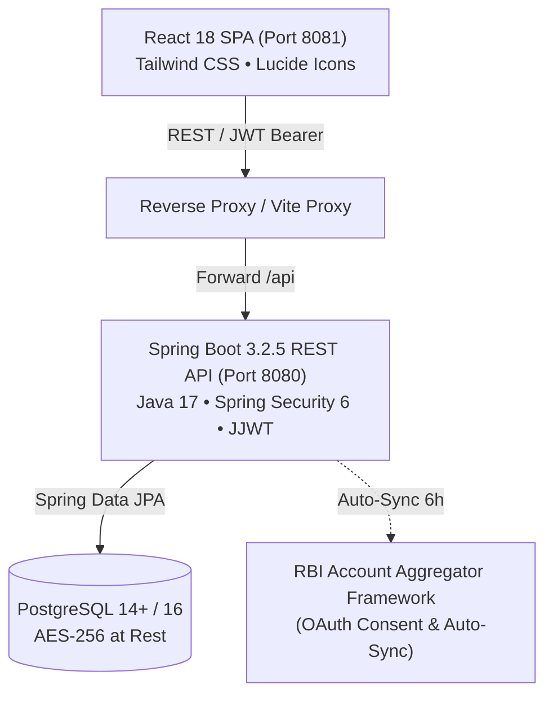

# Personal Finance and Budget Management Application

[](https://github.com/keerthana-rajamani/finance-app/actions)
[](LICENSE)
[](https://spring.io/projects/spring-boot)
[](https://reactjs.org/)
[](https://www.docker.com/)

A comprehensive, bank-grade fullstack application designed according to IEEE Std 830-1998 Software Requirements Specification (SRS) for aggregating bank accounts, automating ML transaction categorization, tracking real-time category budgets, projecting financial goals with SIP mutual fund recommendations, managing recurring bills, calculating investment XIRR, and assisting with income tax filing (80C deductions and capital gains).

---

## 🏛 System Architecture



---

## ✨ Key Features (SRS FR1 - FR17)

- **Authentication & RBAC (FR1, FR2, FR3):** JWT HS256 authentication with role-specific expiration, SHA-256 PAN hashing, and strict role segregation across 5 user classes:
  - `USER`: Primary account holder with full access.
  - `FAMILY_MEMBER`: Shared household budget and split-expense access.
  - `FINANCIAL_ADVISOR`: Read-only investment portfolio and XIRR profile.
  - `SUPPORT`: Masked account data (last 4 digits only) for issue resolution.
  - `ADMIN`: System configuration, compliance, and user management.
- **Bank Account Aggregation (FR4):** RBI Account Aggregator OAuth consent flow (12-month duration), multi-bank support (up to 10 accounts), automated 6-hour polling, and CSV bank statement export.
- **ML Transaction Categorization (FR5):** Automatic classification across 9 taxonomies (*Food, Transport, Utilities, Shopping, Healthcare, Entertainment, Education, Investment, Income*) with confidence scoring. Confidence below 0.75 is queued for user review.
- **Real-Time Category Budgets (FR6):** Category spend tracking with automatic 80% warning and 100% overspend alerts, month-end variance reports, and carry-forward rollovers.
- **Financial Goals & SIP Calculator (FR7):** Animated circular SVG progress rings, target date countdown, monthly savings needed calculation `(target - current) / months`, and risk-adjusted mutual fund SIP scheme recommendations.
- **Recurring Bill Manager (FR8):** 7-day upcoming bill reminders, 30-day interactive calendar view, and 1-tap "Mark as Paid" auto-debit transaction linking.
- **Investment Portfolio & Net Worth (FR9):** DEMAT equity and Mutual Fund tracking, current NAV, consolidated XIRR returns, asset allocation breakdown (Equity, Debt, Gold, Cash), and historical net worth progression.
- **AI Financial Advisor & NLP (FR10, FR15):** 0–850 financial health score, 50-30-20 budget recommendation, debt avalanche vs snowball optimizer, and conversational NLP assistant.
- **Tax Summary & 80C Deductions (FR11):** Automated STCG/LTCG capital gains computation, Schedule OS interest income aggregation, Section 80C headroom tracking (₹1.5L ceiling), and quarterly advance tax schedule.
- **Family Finance & Expense Splitting (FR12):** Multi-user household collaboration with granular privacy scopes and equitable expense splitting calculator.

---

## 🚀 Quick Start with Docker

```bash
# Clone the repository
git clone https://github.com/keerthana-rajamani/finance-app.git
cd finance-app

# Launch entire stack (PostgreSQL 16 + Backend + Frontend)
docker compose up --build -d
```

- **Frontend UI:** [http://localhost:8081](http://localhost:8081)
- **Backend API:** [http://localhost:8080/api](http://localhost:8080/api)

---

## 💻 Local Development Setup

### 1. Backend (Spring Boot 3)
```bash
cd backend
mvn clean spring-boot:run
```
Backend runs on port `8080` with PostgreSQL database (financedb) pre-loaded with realistic demo data.

Run backend tests:
```bash
mvn test
```

### 2. Frontend (React 18)
```bash
cd frontend
npm install
npm run dev
```
Frontend runs on port `8081` with automatic hot module reloading and `/api` proxying.

Build production bundle:
```bash
npm run build
```

---

## 🔑 Pre-Seeded Demo Accounts

You can immediately sign in or use the one-click demo login buttons on the login screen:

| Role | Email | Password |
|---|---|---|
| **Primary User** | `john@example.com` | `Password@123` |
| **Family Member** | `sarah@example.com` | `Password@123` |
| **Financial Advisor** | `advisor@example.com` | `Password@123` |
| **Support Agent** | `support@example.com` | `Password@123` |
| **System Admin** | `admin@example.com` | `Password@123` |

---

## 📡 API Endpoint Reference (Appendix H)

| Method | Endpoint | Description |
|---|---|---|
| `POST` | `/api/auth/register` | Register new user account with validation |
| `POST` | `/api/auth/login` | Authenticate and receive role-specific JWT |
| `POST` | `/api/auth/logout` | Invalidate current user session |
| `GET` | `/api/users/profile` | Current user profile details |
| `GET` | `/api/accounts` | List linked bank accounts with masked numbers |
| `POST` | `/api/accounts/link` | Link bank account via Account Aggregator |
| `DELETE` | `/api/accounts/{id}` | Unlink account and revoke consent |
| `GET` | `/api/transactions` | Query transactions with category/merchant filters |
| `POST` | `/api/transactions` | Record transaction and trigger budget update |
| `GET` | `/api/budgets/summary` | Current month spend vs budget summary |
| `POST` | `/api/budgets` | Create or update category budget |
| `GET` | `/api/goals` | Goals list with progress % and monthly savings needed |
| `POST` | `/api/goals` | Create financial goal |
| `GET` | `/api/bills/upcoming` | Bills due in the next 7 days |
| `POST` | `/api/bills/{id}/pay` | Settle bill and record debit transaction |
| `GET` | `/api/investments` | Holdings with NAV and XIRR |
| `GET` | `/api/investments/allocation` | Asset allocation breakdown |
| `GET` | `/api/networth` | Consolidated asset-liability net worth |
| `GET` | `/api/tax/summary` | Annual capital gains and 80C deductions |
| `GET` | `/api/analytics/insights` | Health score (0-850) and 50-30-20 recommendations |
| `POST` | `/api/analytics/chat` | AI conversational query assistant |

---

## ☁️ Deployment Guide

For comprehensive instructions on deploying to **AWS (ECS + RDS)**, **Azure (App Service + Flexible MySQL)**, **GCP (Cloud Run + Cloud SQL)**, or **Render / Railway / Vercel**, see [DEPLOYMENT.md](DEPLOYMENT.md).

---

## 📄 License
Released under the MIT License.
